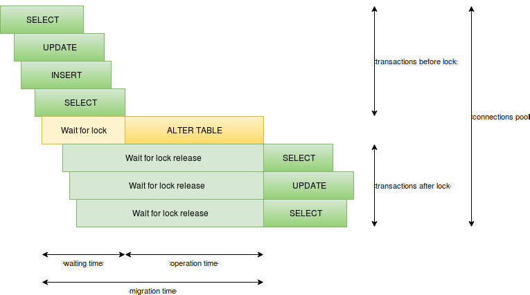

# django-pg-zero-downtime-migrations
Django postgresql backend that apply migrations with respect to database locks.

## Installation

    pip install django-pg-zero-downtime-migrations
    
> *NOTE:* this package works with django 2.0+.

## Usage

To enable zero downtime migrations for postgres just setup django backend provided by this package and add most safe settings:

    DATABASES = {
        'default': {
            'ENGINE': 'django_zero_downtime_migrations.backends.postgres',
            ...
        }
    }
    ZERO_DOWNTIME_MIGRATIONS_LOCK_TIMEOUT = '2s'
    ZERO_DOWNTIME_MIGRATIONS_STATEMENT_TIMEOUT = '2s'
    ZERO_DOWNTIME_MIGRATIONS_FLEXIBLE_STATEMENT_TIMEOUT = True
    ZERO_DOWNTIME_MIGRATIONS_RAISE_FOR_UNSAFE = True
    ZERO_DOWNTIME_MIGRATIONS_USE_NOT_NULL = False

> *NOTE:* this backend brings zero downtime improvements only for migrations (schema and `RunSQL` operations, but not for `RunPython` operation), for other purpose it works the same as standard django backend.

> *NOTE:* this package is in beta, please check your migrations SQL before applying on production and submit issue for any question.

### Differences with standard django backend

This backend provides same result state (instead `NOT NULL` constraint replacement), but different way and with additional guarantees for avoiding stuck tables lock.

This backend doesn't use transactions for migrations (except `RunPython` operation), because not all fixed SQL can be run in transaction and it allows to avoid deadlocks for complex migration. So when your migration will down in middle of transaction you need fix it manually (instead potential downtime).

### Deployment flow

There ara main rules for zero downtime deployment:
1. We have one database;
1. We have several instances with application - application always should be available, even you restart one of instances;
1. We have balancer before instances;
1. Our application works fine before, on and after migration - old application works fine with old and new database schema version;
1. Our application works fine before, on and after instance updating - old and new application versions work fine with new database schema version.

Flow:
1. apply migrations
1. disconnect instance form balancer, restart it and back to balancer - repeat this operation one by one for all instances

If our deployment don't satisfy zero downtime deployment rules, then we split it to smaller deployments.

### Additional settings

#### ZERO_DOWNTIME_MIGRATIONS_LOCK_TIMEOUT

Apply [`statement_timeout`](https://www.postgresql.org/docs/current/static/runtime-config-client.html#GUC-STATEMENT-TIMEOUT) for SQL statements that require `ACCESS EXCLUSIVE` lock, default `None`:

    ZERO_DOWNTIME_MIGRATIONS_LOCK_TIMEOUT = '2s'
    
Allowed values:
 - `None` - current postgres setting used
 - other - timeout will be applied, `0` and equivalents mean that timeout will be disabled

#### ZERO_DOWNTIME_MIGRATIONS_STATEMENT_TIMEOUT

Apply [`lock_timeout`](https://www.postgresql.org/docs/current/static/runtime-config-client.html#GUC-LOCK-TIMEOUT) for SQL statements that require `ACCESS EXCLUSIVE` lock, default `None`:

    ZERO_DOWNTIME_MIGRATIONS_STATEMENT_TIMEOUT = '2s'
    
Allowed values:
 - `None` - current postgres setting used
 - other - timeout will be applied, `0` and equivalents mean that timeout will be disabled

#### ZERO_DOWNTIME_MIGRATIONS_FLEXIBLE_STATEMENT_TIMEOUT

Set [`statement_timeout`](https://www.postgresql.org/docs/current/static/runtime-config-client.html#GUC-STATEMENT-TIMEOUT) to `0ms` for SQL statements that require `SHARE UPDATE EXCLUSIVE` lock that useful in case when `statement_timeout` enabled globally and you try run long-running operations like index creation or constraint validation, default `False`:

    ZERO_DOWNTIME_MIGRATIONS_FLEXIBLE_STATEMENT_TIMEOUT = True

#### ZERO_DOWNTIME_MIGRATIONS_RAISE_FOR_UNSAFE

Enabled option doesn't allow run potential unsafe migration, default `False`:

    ZERO_DOWNTIME_MIGRATIONS_RAISE_FOR_UNSAFE = True

#### ZERO_DOWNTIME_MIGRATIONS_USE_NOT_NULL

Set policy for avoiding `NOT NULL` constraint creation long lock, default `None`:

    ZERO_DOWNTIME_MIGRATIONS_USE_NOT_NULL = 10 ** 7

Allowed values:
 - `None` - standard django's behaviour (raise for `ZERO_DOWNTIME_MIGRATIONS_RAISE_FOR_UNSAFE = True`)
 - `True` - always replace `NOT NULL` constraint with `CHECK (field IS NOT NULL)` (don't raise for `ZERO_DOWNTIME_MIGRATIONS_RAISE_FOR_UNSAFE = True`)
 - `False` - always use `NOT NULL` constraint (don't raise for `ZERO_DOWNTIME_MIGRATIONS_RAISE_FOR_UNSAFE = True`)
 - `int` value - use `CHECK (field IS NOT NULL)` instead `NOT NULL` constraint if table has more than `value` rows (approximate rows count used) otherwise use `NOT NULL` constraint (don't raise for `ZERO_DOWNTIME_MIGRATIONS_RAISE_FOR_UNSAFE = True`)

### Dealing with partial indexes

If you using https://github.com/mattiaslinnap/django-partial-index package for partial indexes in postgres, then you can easily make this package also safe for migrations:

    from django_zero_downtime_migrations_postgres_backend.schema import PGShareUpdateExclusive
    from partial_index import PartialIndex

    PartialIndex.sql_create_index['postgresql'] = PGShareUpdateExclusive(
        'CREATE%(unique)s INDEX CONCURRENTLY %(name)s ON %(table)s%(using)s (%(columns)s)%(extra)s WHERE %(where)s',
        disable_statement_timeout=True
    )

## How it works

### Postgres table level locks

Postgres has different locks on table level that can conflict with each other https://www.postgresql.org/docs/current/static/explicit-locking.html#LOCKING-TABLES:

|                          | `ACCESS SHARE` | `ROW SHARE` | `ROW EXCLUSIVE` | `SHARE UPDATE EXCLUSIVE` | `SHARE` | `SHARE ROW EXCLUSIVE` | `EXCLUSIVE` | `ACCESS EXCLUSIVE` |
|--------------------------|:--------------:|:-----------:|:---------------:|:------------------------:|:-------:|:---------------------:|:-----------:|:------------------:|
| `ACCESS SHARE`           |                |             |                 |                          |         |                       |             | X                  |
| `ROW SHARE`              |                |             |                 |                          |         |                       | X           | X                  |
| `ROW EXCLUSIVE`          |                |             |                 |                          | X       | X                     | X           | X                  |
| `SHARE UPDATE EXCLUSIVE` |                |             |                 | X                        | X       | X                     | X           | X                  |
| `SHARE`                  |                |             | X               | X                        |         | X                     | X           | X                  |
| `SHARE ROW EXCLUSIVE`    |                |             | X               | X                        | X       | X                     | X           | X                  |
| `EXCLUSIVE`              |                | X           | X               | X                        | X       | X                     | X           | X                  |
| `ACCESS EXCLUSIVE`       | X              | X           | X               | X                        | X       | X                     | X           | X                  |

### Migration and business logic locks

Lets split this lock to migration and business logic operations.

- Migration operations work synchronously in one thread and cover schema migrations (data migrations conflict with business logic operations same as business logic conflict concurrently).
- Business logic operations work concurrently.

#### Migration locks

| lock                     | operations                                                                                                |
|--------------------------|-----------------------------------------------------------------------------------------------------------|
| `ACCESS EXCLUSIVE`       | `CREATE SEQUENCE`, `DROP SEQUENCE`, `CREATE TABLE`, `DROP TABLE` \*, `ALTER TABLE` \*\*, `DROP INDEX`     |
| `SHARE`                  | `CREATE INDEX`                                                                                            |
| `SHARE UPDATE EXCLUSIVE` | `CREATE INDEX CONCURRENTLY`, `DROP INDEX CONCURRENTLY` \*\*\*, `ALTER TABLE VALIDATE CONSTRAINT` \*\*\*\* |

\*: `CREATE SEQUENCE`, `DROP SEQUENCE`, `CREATE TABLE`, `DROP TABLE` shouldn't have conflicts, because your logic shouldn't operate with it

\*\*: Not all `ALTER TABLE` operations take `ACCESS EXCLUSIVE` lock, but all current django's migrations take it https://github.com/django/django/blob/master/django/db/backends/base/schema.py, https://github.com/django/django/blob/master/django/db/backends/postgresql/schema.py and https://www.postgresql.org/docs/current/static/sql-altertable.html

\*\*\*: Django currently doesn't support `CONCURRENTLY` operations

\*\*\*\*: Django doesn't have `VALIDATE CONSTRAINT` logic, but we will use it for some cases

#### Business logic locks

| lock            | operations                   | conflict with lock                                              | conflict with operations                    |
|-----------------|------------------------------|-----------------------------------------------------------------|---------------------------------------------|
| `ACCESS SHARE`  | `SELECT`                     | `ACCESS EXCLUSIVE`                                              | `ALTER TABLE`, `DROP INDEX`                 |
| `ROW SHARE`     | `SELECT FOR UPDATE`          | `ACCESS EXCLUSIVE`, `EXCLUSIVE`                                 | `ALTER TABLE`, `DROP INDEX`                 |
| `ROW EXCLUSIVE` | `INSERT`, `UPDATE`, `DELETE` | `ACCESS EXCLUSIVE`, `EXCLUSIVE`, `SHARE ROW EXCLUSIVE`, `SHARE` | `ALTER TABLE`, `DROP INDEX`, `CREATE INDEX` |

So you can find that all django schema changes for exist table conflicts with business logic, but fortunately they are safe or has safe alternative in general.

### Postgres row level locks

As business logic mostly works with table rows it's also important to understand lock conflicts on row level https://www.postgresql.org/docs/current/static/explicit-locking.html#LOCKING-ROWS:

| lock                | `FOR KEY SHARE` | `FOR SHARE` | `FOR NO KEY UPDATE` | `FOR UPDATE` |
|---------------------|:---------------:|:-----------:|:-------------------:|:------------:|
| `FOR KEY SHARE`     |                 |             |                     | X            |
| `FOR SHARE`         |                 |             | X                   | X            |
| `FOR NO KEY UPDATE` |                 | X           | X                   | X            |
| `FOR UPDATE`        | X               | X           | X                   | X            |

Main point there is if you have two transactions that update one row, then second transaction will wait until first will be completed. So for business logic and data migrations better to avoid updates for whole table and use batch operations instead.

> *NOTE:* batch operations also can work faster because it helps postgres make more optimal execution plan.

### Transactions FIFO waiting

Found same diagram in interesting article http://pankrat.github.io/2015/django-migrations-without-downtimes/.

In this diagram we can extract several metrics:

1. operation time - time what you spend for schema change, so there is issue for long running operation on many rows tables like `CREATE INDEX` or `ALTER TABLE ADD COLUMN SET DEFAULT`, so you need use more save equivalents instead.
2. waiting time - your migration will wait until all transactions will be completed, so there is issue for long running operations/transactions like analytic, so you need avoid it or disable on migration time.
3. queries per second + execution time and connections pool - if you too many queries to table and this queries take long time then this queries can just take all available connections to database until wait for release lock, so look like you need different optimizations there: run migrations when load minimal, decrease queries count and execution time, split you data.
4. too many operations in one transaction - you have issues in all previous points for one operation so if you have many operations in one transaction then you have more chances to get this issues, so you should avoid many operations in one transactions (or event don't run it in transactions at all but you should be more careful when some operation will fail).

### Dealing with timeouts

Postgres has two settings to dealing with `waiting time` and `operation time` presented in diagram: `lock_timeout` and `statement_timeout`.

`SET lock_timeout TO '2s'` allow you to avoid downtime when you have long running query/transaction before run migration (https://www.postgresql.org/docs/current/static/runtime-config-client.html#GUC-LOCK-TIMEOUT).

`SET statement_timeout TO '2s'` allow you to avoid downtime when you have long running migration query (https://www.postgresql.org/docs/current/static/runtime-config-client.html#GUC-STATEMENT-TIMEOUT).

### Deadlocks

There no downtime issues for deadlocks, but too many operations in one transaction will take most conflictable lock and release it only after transaction commit or rollback. So it's a good idea to avoid `ACCESS EXCLUSIVE` lock operations and long time operations in one transaction. Deadlocks also can make you migration stuck on production deployment when different tables will be locked, for example, for FOREIGN KEY that take `ACCESS EXCLUSIVE` lock for two tables.

### Rows and values storing

Postgres store values of different types different ways https://www.postgresql.org/docs/current/static/storage-toast.html#STORAGE-TOAST-ONDISK. When you try to convert one type to another and it stored different way postgres will rewrite all values. Fortunately some types stored same way and postgres need to do nothing to change type, but in some cases postgres need to check that all values have same with new type limitations.  

### Multiversion Concurrency Control

Regarding documentation https://www.postgresql.org/docs/current/static/mvcc-intro.html data consistency in postgres is maintained by using a multiversion model. This means that each SQL statement sees a snapshot of data. It has advantage that adding and deleting columns without any indexes, constrains and defaults do not change exist data, new version of data will be create on `INSERT` and `UPDATE`, delete just mark you record expired. All garbage will be collected later by `VACUUM` or `AUTO VACUUM`.

### Django migrations hacks

Any schema changes can be processed with creation of new table and copy data to it, so just mark unsafe operations that don't have another safe way without downtime as `NO`.

|  # | name                                          | safe | safe alternative              | description |
|---:|-----------------------------------------------|:----:|:-----------------------------:|-------------|
|  1 | `CREATE SEQUENCE`                             | X    |                               | safe operation, because your business logic shouldn't operate with new sequence on migration time \*
|  2 | `DROP SEQUENCE`                               | X    |                               | safe operation, because your business logic shouldn't operate with this sequence on migration time \*
|  3 | `CREATE TABLE`                                | X    |                               | safe operation, because your business logic shouldn't operate with new table on migration time \*
|  4 | `DROP TABLE`                                  | X    |                               | safe operation, because your business logic shouldn't operate with this table on migration time \*
|  5 | `ALTER TABLE RENAME TO`                       |      | **NO**                        | **unsafe operation**, it's too hard write business logic that operate with two tables simultaneously, so propose `CREATE TABLE` and then copy all data to new table \*
|  6 | `ALTER TABLE SET TABLESPACE`                  |      | **NO**                        | **unsafe operation**, but probably you don't need it at all or often \*
|  7 | `ALTER TABLE ADD COLUMN`                      | X    |                               | safe operation if without `SET NOT NULL`, `SET DEFAULT`, `PRIMARY KEY`, `UNIQUE` \*
|  8 | `ALTER TABLE ADD COLUMN SET DEFAULT`          |      | add column and set default    | **unsafe operation**, because you spend time in migration to populate all values in table, so propose `ALTER TABLE ADD COLUMN` and then populate column and then `SET DEFAULT` \*
|  9 | `ALTER TABLE ADD COLUMN SET NOT NULL`         |      | +/-                           | **unsafe operation**, because doesn't work without `SET DEFAULT`, so propose `ALTER TABLE ADD COLUMN` and then populate column and then `ALTER TABLE ALTER COLUMN SET NOT NULL` \* and \*\*
| 10 | `ALTER TABLE ADD COLUMN PRIMARY KEY`          |      | add index and add constraint  | **unsafe operation**, because you spend time in migration to `CREATE INDEX`, so propose `ALTER TABLE ADD COLUMN` and then `CREATE INDEX CONCURRENTLY` and then `ALTER TABLE ADD CONSTRAINT PRIMARY KEY USING INDEX` \*\*\*
| 11 | `ALTER TABLE ADD COLUMN UNIQUE`               |      | add index and add constraint  | **unsafe operation**, because you spend time in migration to `CREATE INDEX`, so propose `ALTER TABLE ADD COLUMN` and then `CREATE INDEX CONCURRENTLY` and then `ALTER TABLE ADD CONSTRAINT UNIQUE USING INDEX` \*\*\*
| 12 | `ALTER TABLE ALTER COLUMN TYPE`               |      | +/-                           | **unsafe operation**, because you spend time in migration to check that all items in column valid or to change type, but some operations can be safe \*\*\*\*
| 13 | `ALTER TABLE ALTER COLUMN SET NOT NULL`       |      | +/-                           | **unsafe operation**, because you spend time in migration to check that all items in column `NOT NULL` \*\*
| 14 | `ALTER TABLE ALTER COLUMN DROP NOT NULL`      | X    |                               | safe operation
| 15 | `ALTER TABLE ALTER COLUMN SET DEFAULT`        | X    |                               | safe operation
| 16 | `ALTER TABLE ALTER COLUMN DROP DEFAULT`       | X    |                               | safe operation
| 17 | `ALTER TABLE DROP COLUMN`                     | X    |                               | safe operation, because you business logic shouldn't operate with this column on migration time, however better `ALTER TABLE ALTER COLUMN DROP NOT NULL`, `ALTER TABLE DROP CONSTRAINT` and `DROP INDEX` before \* and \*\*\*\*\*
| 18 | `ALTER TABLE RENAME COLUMN`                   |      | new column and copy           | **unsafe operation**, it's too hard write business logic that operate with two columns simultaneously, so propose `ALTER TABLE CREATE COLUMN` and then copy all data to new column \*
| 19 | `ALTER TABLE ADD CONSTRAINT CHECK`            |      | add as not valid and validate | **unsafe operation**, because you spend time in migration to check constraint
| 20 | `ALTER TABLE DROP CONSTRAINT` (`CHECK`)       | X    |                               | safe operation
| 21 | `ALTER TABLE ADD CONSTRAINT FOREIGN KEY`      |      | add as not valid and validate | **unsafe operation**, because you spend time in migration to check constraint, lock two tables
| 22 | `ALTER TABLE DROP CONSTRAINT` (`FOREIGN KEY`) | X    |                               | safe operation, lock two tables
| 23 | `ALTER TABLE ADD CONSTRAINT PRIMARY KEY`      |      | add index and add constraint  | **unsafe operation**, because you spend time in migration to create index \*\*\*
| 24 | `ALTER TABLE DROP CONSTRAINT` (`PRIMARY KEY`) | X    |                               | safe operation \*\*\*
| 25 | `ALTER TABLE ADD CONSTRAINT UNIQUE`           |      | add index and add constraint  | **unsafe operation**, because you spend time in migration to create index \*\*\*
| 26 | `ALTER TABLE DROP CONSTRAINT` (`UNIQUE`)      | X    |                               | safe operation \*\*\*
| 27 | `CREATE INDEX`                                |      | `CREATE INDEX CONCURRENTLY`   | **unsafe operation**, because you spend time in migration to create index
| 28 | `DROP INDEX`                                  | X    | `DROP INDEX CONCURRENTLY`     | safe operation  \*\*\*

\*: main point with migration on production without downtime that your code should correctly work before and after migration, lets look this point closely below

\*\*: postgres will check that all items in column `NOT NULL` that take time, lets look this point closely below

\*\*\*: postgres will have same behaviour when you skip `ALTER TABLE ADD CONSTRAINT UNIQUE USING INDEX` and still unclear difference with `CONCURRENTLY` except difference in locks, lets look this point closely below

\*\*\*\*: lets look this point closely below

\*\*\*\*\*: if you check migration on CI with `python manage.py makemigrations --check` you can't drop column in code without migration creation, so in this case you can be useful *back migration flow*: apply code on all instances and then migrate database

#### Dealing with logic that should work before and after migration

##### New and removing models and columns

Migrations: `CREATE SEQUENCE`, `DROP SEQUENCE`, `CREATE TABLE`, `DROP TABLE`, `ALTER TABLE ADD COLUMN`, `ALTER TABLE DROP COLUMN`.

This migrations are pretty safe, because your logic doesn't work with this data before migration

##### Changes for working logic

Migrations: `ALTER TABLE RENAME TO`, `ALTER TABLE SET TABLESPACE`, `ALTER TABLE RENAME COLUMN`.

For this migration too hard implement logic that will work correctly for all instances, so there are two ways to dealing with it:

1. create new table/column, copy exist data, drop old table/column
2. downtime

##### Create column with default

Migrations: `ALTER TABLE ADD COLUMN SET DEFAULT`.

Standard django's behaviour for creation column with default is populate all values with default. Django don't use database defaults permanently, so when you add new column with default django will create column with default and drop this default at once, eg. new default will come from django code. In this case you can have a gap when migration applied by not all instances has updated and at this moment new rows in table will be without default and probably you need update nullable values after that. So to avoid this case best way is avoid creation column with default and split column creation (with default for new rows) and data population to two migrations (with deployments).

#### Dealing with `NOT NULL` constraint

Postgres check that all column items `NOT NULL` when you applying `NOT NULL` constraint, unfortunately you can't defer this check as for `NOT VALID`. But we have some hacks and alternatives there.

1. Run migrations when load minimal to avoid negative affect of locking.
2. `SET statement_timeout` and try to set `NOT NULL` constraint for small tables.
3. Use `CHECK (column IS NOT NULL)` constraint instead that support `NOT VALID` option with next `VALIDATE CONSTRAINT`, see article for details https://medium.com/doctolib-engineering/adding-a-not-null-constraint-on-pg-faster-with-minimal-locking-38b2c00c4d1c.

#### Dealing with `UNIQUE` constraint

Postgres has two approaches for uniqueness: `CREATE UNIQUE INDEX` and `ALTER TABLE ADD CONSTRAINT UNIQUE` - both use unique index inside. Difference that I see that you cannot apply `DROP INDEX CONCURRENTLY` for constraint. However still unclear what difference for `DROP INDEX` and `DROP INDEX CONCURRENTLY` except difference in locks, but as you see before both marked as safe - you don't spend time in `DROP INDEX`, just wait for lock. So as django use constraint for uniqueness we also have a hacks to use constraint safely.

#### Dealing with `ALTER TABLE ALTER COLUMN TYPE`

Next operations are safe:

1. `varchar(LESS)` to `varchar(MORE)` where LESS < MORE
2. `varchar(ANY)` to `text`
3. `numeric(LESS, SAME)` to `numeric(MORE, SAME)` where LESS < MORE and SAME == SAME

For other types migration will rewrite whole table (eg. will get downtime), so there are two ways to dealing with it:

1. create new column, copy exist data, drop old column
2. downtime

For other operations propose to create new column and copy data to it. Eg. some types can be also safe, but you should check yourself.
