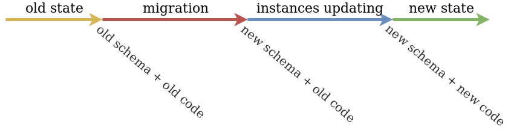
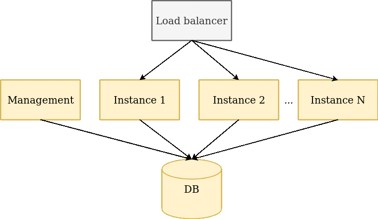
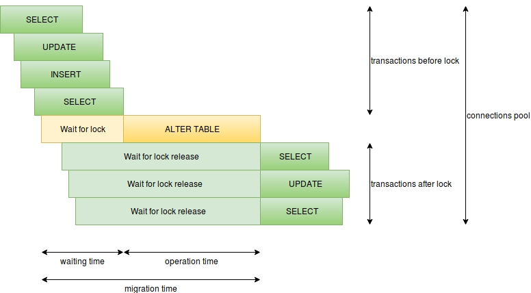

[](https://pypi.org/project/django-pg-zero-downtime-migrations/)


[](https://raw.githubusercontent.com/tbicr/django-pg-zero-downtime-migrations/master/LICENSE)

[](https://pypistats.org/packages/django-pg-zero-downtime-migrations)
[](https://github.com/tbicr/django-pg-zero-downtime-migrations/commits/master)
[](https://github.com/tbicr/django-pg-zero-downtime-migrations/actions)

# django-pg-zero-downtime-migrations

Django postgresql backend that apply migrations with respect to database locks.

## Installation

    pip install django-pg-zero-downtime-migrations

## Usage

To enable zero downtime migrations for postgres just setup django backend provided by this package and add most safe settings:

    DATABASES = {
        'default': {
            'ENGINE': 'django_zero_downtime_migrations.backends.postgres',
            #'ENGINE': 'django_zero_downtime_migrations.backends.postgis',
            ...
        }
    }
    ZERO_DOWNTIME_MIGRATIONS_LOCK_TIMEOUT = '2s'
    ZERO_DOWNTIME_MIGRATIONS_STATEMENT_TIMEOUT = '2s'
    ZERO_DOWNTIME_MIGRATIONS_FLEXIBLE_STATEMENT_TIMEOUT = True
    ZERO_DOWNTIME_MIGRATIONS_RAISE_FOR_UNSAFE = True

> _NOTE:_ this backend brings zero downtime improvements only for migrations (schema and `RunSQL` operations, but not for `RunPython` operation), for other purpose it works the same as standard django backend.

> _NOTE:_ this package is in beta, please check your migrations SQL before applying on production and submit issue for any question.

### Differences with standard django backend

This backend provides same result state (except of `ZERO_DOWNTIME_MIGRATIONS_KEEP_DEFAULT=True` usage for django < 5.0), but different way and with additional guarantees for avoiding stuck table locks.

This backend doesn't use transactions for migrations (except `RunPython` operation), because not all SQL fixes can be run in transaction and it allows to avoid deadlocks for complex migration. So when your migration will down in the middle of migration file operations you need to fix db state manually (instead potential downtime). For that reason good practice to make migration modules small as possible. Also `ZERO_DOWNTIME_MIGRATIONS_IDEMPOTENT_SQL=True` allows to automate manual db state fixing.

### Deployment flow

There are requirements for zero downtime deployment:

1. We have one database;
1. We have several instances with application - application always should be available, even you restart one of instances;
1. We have balancer before instances;
1. Our application works fine before, on and after migration - old application works fine with old and new database schema version;
1. Our application works fine before, on and after instance updating - old and new application versions work fine with new database schema version.



Flow:

1. apply migrations
1. disconnect instance form balancer, restart it and back to balancer - repeat this operation one by one for all instances

If our deployment don't satisfy zero downtime deployment rules, then we split it to smaller deployments.



### Settings

#### ZERO_DOWNTIME_MIGRATIONS_LOCK_TIMEOUT

Apply [`lock_timeout`](https://www.postgresql.org/docs/current/static/runtime-config-client.html#GUC-LOCK-TIMEOUT) for SQL statements that require `ACCESS EXCLUSIVE` lock, default `None`:

    ZERO_DOWNTIME_MIGRATIONS_LOCK_TIMEOUT = '2s'

Allowed values:

- `None` - current postgres setting used
- other - timeout will be applied, `0` and equivalents mean that timeout will be disabled

#### ZERO_DOWNTIME_MIGRATIONS_STATEMENT_TIMEOUT

Apply [`statement_timeout`](https://www.postgresql.org/docs/current/static/runtime-config-client.html#GUC-STATEMENT-TIMEOUT) for SQL statements that require `ACCESS EXCLUSIVE` lock, default `None`:

    ZERO_DOWNTIME_MIGRATIONS_STATEMENT_TIMEOUT = '2s'

Allowed values:

- `None` - current postgres setting used
- other - timeout will be applied, `0` and equivalents mean that timeout will be disabled

#### ZERO_DOWNTIME_MIGRATIONS_FLEXIBLE_STATEMENT_TIMEOUT

Set [`statement_timeout`](https://www.postgresql.org/docs/current/static/runtime-config-client.html#GUC-STATEMENT-TIMEOUT) to `0ms` for SQL statements that require `SHARE UPDATE EXCLUSIVE` lock that useful in case when `statement_timeout` enabled globally and you try run long-running operations like index creation or constraint validation, default `False`:

    ZERO_DOWNTIME_MIGRATIONS_FLEXIBLE_STATEMENT_TIMEOUT = True

#### ZERO_DOWNTIME_MIGRATIONS_RAISE_FOR_UNSAFE

Enabled option doesn't allow run potential unsafe migration, default `False`:

    ZERO_DOWNTIME_MIGRATIONS_RAISE_FOR_UNSAFE = True

#### ZERO_DOWNTIME_DEFERRED_SQL

Define way to apply deferred sql, default `True`:

    ZERO_DOWNTIME_DEFERRED_SQL = True

Allowed values:
- `True` - run deferred sql similar to default django way
- `False` - run deferred sql as soon as possible

#### ZERO_DOWNTIME_MIGRATIONS_IDEMPOTENT_SQL

Define idempotent mode, default `False`:

    ZERO_DOWNTIME_MIGRATIONS_IDEMPOTENT_SQL = False

Allowed values:
- `True` - skip already applied sql migrations
- `False` - standard non atomic django behaviour

As this backend doesn't use transactions for migrations any failed migration can be cause of stopped process in intermediate state.
To avoid manual schema manipulation idempotent mode allows to rerun failed migration after fixed issue (eg. data issue or long running CRUD queries).

> _NOTE:_ idempotent mode checks rely only on name and index and constraint valid state, so it can ignore name collisions and recommended do not use it for CI checks.

#### ZERO_DOWNTIME_MIGRATIONS_KEEP_DEFAULT

Define way keep or drop code defaults on database level when adding new column, default `False`:

    ZERO_DOWNTIME_MIGRATIONS_KEEP_DEFAULT = False

Allowed values:
- `True` - after adding column with code default this default will not be dropped, this option allows to use `ALTER TABLE ADD COLUMN SET DEFAULT NOT NULL` as safe operation that much more simple and efficient than creating column without default on database level and populating column next
- `False` - after adding column with code default this default will be dropped, this is standard django behaviour

> _NOTE:_ this option works only for django < 5.0, in django 5.0+ explicit [`db_default`](https://docs.djangoproject.com/en/dev/ref/models/fields/#db-default) should be used instead.

#### PgBouncer and timeouts

In case you using [PgBouncer](https://www.pgbouncer.org/) and expect timeouts will work as expected you need make sure that run migrations using [session pool_mode](https://www.pgbouncer.org/config.html#pool_mode) or use direct database connection.

## How it works

### Postgres table level locks

Postgres has different locks on table level that can conflict with each other https://www.postgresql.org/docs/current/static/explicit-locking.html#LOCKING-TABLES:

|                          | `ACCESS SHARE` | `ROW SHARE` | `ROW EXCLUSIVE` | `SHARE UPDATE EXCLUSIVE` | `SHARE` | `SHARE ROW EXCLUSIVE` | `EXCLUSIVE` | `ACCESS EXCLUSIVE` |
| ------------------------ | :------------: | :---------: | :-------------: | :----------------------: | :-----: | :-------------------: | :---------: | :----------------: |
| `ACCESS SHARE`           |                |             |                 |                          |         |                       |             |         X          |
| `ROW SHARE`              |                |             |                 |                          |         |                       |      X      |         X          |
| `ROW EXCLUSIVE`          |                |             |                 |                          |    X    |           X           |      X      |         X          |
| `SHARE UPDATE EXCLUSIVE` |                |             |                 |            X             |    X    |           X           |      X      |         X          |
| `SHARE`                  |                |             |        X        |            X             |         |           X           |      X      |         X          |
| `SHARE ROW EXCLUSIVE`    |                |             |        X        |            X             |    X    |           X           |      X      |         X          |
| `EXCLUSIVE`              |                |      X      |        X        |            X             |    X    |           X           |      X      |         X          |
| `ACCESS EXCLUSIVE`       |       X        |      X      |        X        |            X             |    X    |           X           |      X      |         X          |

### Migration and business logic locks

Lets split this lock to migration and business logic operations.

- Migration operations work synchronously in one thread and cover schema migrations (data migrations conflict with business logic operations same as business logic conflict concurrently).
- Business logic operations work concurrently.

#### Migration locks

| lock                     | operations                                                                                            |
| ------------------------ | ----------------------------------------------------------------------------------------------------- |
| `ACCESS EXCLUSIVE`       | `CREATE SEQUENCE`, `DROP SEQUENCE`, `CREATE TABLE`, `DROP TABLE` \*, `ALTER TABLE` \*\*, `DROP INDEX` |
| `SHARE`                  | `CREATE INDEX`                                                                                        |
| `SHARE UPDATE EXCLUSIVE` | `CREATE INDEX CONCURRENTLY`, `DROP INDEX CONCURRENTLY`, `ALTER TABLE VALIDATE CONSTRAINT` \*\*\*      |

\*: `CREATE SEQUENCE`, `DROP SEQUENCE`, `CREATE TABLE`, `DROP TABLE` shouldn't have conflicts, because your business logic shouldn't yet operate with created tables and shouldn't already operate with deleted tables.

\*\*: Not all `ALTER TABLE` operations take `ACCESS EXCLUSIVE` lock, but all current django's migrations take it https://github.com/django/django/blob/master/django/db/backends/base/schema.py, https://github.com/django/django/blob/master/django/db/backends/postgresql/schema.py and https://www.postgresql.org/docs/current/static/sql-altertable.html.

\*\*\*: Django doesn't have `VALIDATE CONSTRAINT` logic, but we will use it for some cases.

#### Business logic locks

| lock            | operations                   | conflict with lock                                              | conflict with operations                    |
| --------------- | ---------------------------- | --------------------------------------------------------------- | ------------------------------------------- |
| `ACCESS SHARE`  | `SELECT`                     | `ACCESS EXCLUSIVE`                                              | `ALTER TABLE`, `DROP INDEX`                 |
| `ROW SHARE`     | `SELECT FOR UPDATE`          | `ACCESS EXCLUSIVE`, `EXCLUSIVE`                                 | `ALTER TABLE`, `DROP INDEX`                 |
| `ROW EXCLUSIVE` | `INSERT`, `UPDATE`, `DELETE` | `ACCESS EXCLUSIVE`, `EXCLUSIVE`, `SHARE ROW EXCLUSIVE`, `SHARE` | `ALTER TABLE`, `DROP INDEX`, `CREATE INDEX` |

So you can find that all django schema changes for exist table conflicts with business logic, but fortunately they are safe or has safe alternative in general.

### Postgres row level locks

As business logic mostly works with table rows it's also important to understand lock conflicts on row level https://www.postgresql.org/docs/current/static/explicit-locking.html#LOCKING-ROWS:

| lock                | `FOR KEY SHARE` | `FOR SHARE` | `FOR NO KEY UPDATE` | `FOR UPDATE` |
| ------------------- | :-------------: | :---------: | :-----------------: | :----------: |
| `FOR KEY SHARE`     |                 |             |                     |      X       |
| `FOR SHARE`         |                 |             |          X          |      X       |
| `FOR NO KEY UPDATE` |                 |      X      |          X          |      X       |
| `FOR UPDATE`        |        X        |      X      |          X          |      X       |

Main point there is if you have two transactions that update one row, then second transaction will wait until first will be completed. So for business logic and data migrations better to avoid updates for whole table and use batch operations instead.

> _NOTE:_ batch operations also can work faster because postgres can use more optimal execution plan with indexes for small data range.

### Transactions FIFO waiting



Found same diagram in interesting article http://pankrat.github.io/2015/django-migrations-without-downtimes/.

In this diagram we can extract several metrics:

1. operation time - time spent changing schema, in the case of long running operations on many rows tables like `CREATE INDEX` or `ALTER TABLE ADD CONSTRAINT`, so you need a safe equivalent.
2. waiting time - your migration will wait until all transactions complete, so there is issue for long running operations/transactions like analytic, so you need avoid it or disable during migration.
3. queries per second + execution time and connections pool - if executing many queries, especially long running ones, they can consume all available database connections until the lock is released, so you need different optimizations there: run migrations when least busy, decrease query count and execution time, split data.
4. too many operations in one transaction - you have issues in all previous points for one operation so if you have many operations in one transaction then you have more likelihood to get this issue, so you need avoid too many simultaneous operations in a single transaction (or even not run it in a transaction at all but being careful when an operation fails).

### Dealing with timeouts

Postgres has two settings to dealing with `waiting time` and `operation time` presented in diagram: `lock_timeout` and `statement_timeout`.

`SET lock_timeout TO '2s'` allow you to avoid downtime when you have long running query/transaction before run migration (https://www.postgresql.org/docs/current/static/runtime-config-client.html#GUC-LOCK-TIMEOUT).

`SET statement_timeout TO '2s'` allow you to avoid downtime when you have long running migration query (https://www.postgresql.org/docs/current/static/runtime-config-client.html#GUC-STATEMENT-TIMEOUT).

### Deadlocks

There no downtime issues for deadlocks, but too many operations in one transaction can take most conflicted lock and release it only after transaction commit or rollback. So it's a good idea to avoid `ACCESS EXCLUSIVE` lock operations and long time operations in one transaction. Deadlocks also can make you migration stuck on production deployment when different tables will be locked, for example, for FOREIGN KEY that take `ACCESS EXCLUSIVE` lock for two tables.

### Rows and values storing

Postgres store values of different types different ways. If you try to convert one type to another and it stored different way then postgres will rewrite all values. Fortunately some types stored same way and postgres need to do nothing to change type, but in some cases postgres need to check that all values have same with new type limitations, for example string length.

### Multiversion Concurrency Control

Regarding documentation https://www.postgresql.org/docs/current/static/mvcc-intro.html data consistency in postgres is maintained by using a multiversion model. This means that each SQL statement sees a snapshot of data. It has advantage for adding and deleting columns without any indexes, constrains and defaults do not change exist data, new version of data will be created on `INSERT` and `UPDATE`, delete just mark you record expired. All garbage will be collected later by `VACUUM` or `AUTO VACUUM`.

### Django migrations hacks

Any schema changes can be processed with creation of new table and copy data to it, but it can take significant time.

|   # | name                                          | safe |       safe alternative        | description                                                                                                                                                                                                                                                                                                                                     |
| --: |-----------------------------------------------|:----:|:-----------------------------:|-------------------------------------------------------------------------------------------------------------------------------------------------------------------------------------------------------------------------------------------------------------------------------------------------------------------------------------------------|
|   1 | `CREATE SEQUENCE`                             |  X   |                               | safe operation, because your business logic shouldn't operate with new sequence on migration time \*                                                                                                                                                                                                                                            |
|   2 | `DROP SEQUENCE`                               |  X   |                               | safe operation, because your business logic shouldn't operate with this sequence on migration time \*                                                                                                                                                                                                                                           |
|   3 | `CREATE TABLE`                                |  X   |                               | safe operation, because your business logic shouldn't operate with new table on migration time \*                                                                                                                                                                                                                                               |
|   4 | `DROP TABLE`                                  |  X   |                               | safe operation, because your business logic shouldn't operate with this table on migration time \*                                                                                                                                                                                                                                              |
|   5 | `ALTER TABLE RENAME TO`                       |      |      use updatable view       | **unsafe operation**, because it's too hard write business logic that operate with two tables simultaneously, so propose to use temporary updatable view and switch names in transaction \*                                                                                                                                                     |
|   6 | `ALTER TABLE SET TABLESPACE`                  |      |  add new table and copy data  | **unsafe operation**, but probably you don't need it at all or often \*                                                                                                                                                                                                                                                                         |
|   7 | `ALTER TABLE ADD COLUMN`                      |  X   |                               | safe operation if without `SET NOT NULL`, `PRIMARY KEY`, `UNIQUE` \*                                                                                                                                                                                                                                                                            |
|   8 | `ALTER TABLE ADD COLUMN SET DEFAULT`          |  X   |                               | safe operation, however it can be unsafe if code default used within `NOT NULL`, for `db_default` or `NULL` there are no issue \*                                                                                                                                                                                                               |
|   9 | `ALTER TABLE ADD COLUMN SET NOT NULL`         |      |              +/-              | **unsafe operation**, because doesn't work without `SET DEFAULT` or after migration old code can insert rows without new column and raise exception, so propose to use `ALTER TABLE ADD COLUMN SET DEFAULT` with `db_default` or `ALTER TABLE ADD COLUMN` and then populate column and then `ALTER TABLE ALTER COLUMN SET NOT NULL` \* and \*\* |
|  10 | `ALTER TABLE ADD COLUMN PRIMARY KEY`          |      | add index and add constraint  | **unsafe operation**, because you spend time in migration to `CREATE INDEX`, so propose `ALTER TABLE ADD COLUMN` and then `CREATE INDEX CONCURRENTLY` and then `ALTER TABLE ADD CONSTRAINT PRIMARY KEY USING INDEX` \*\*\*                                                                                                                      |
|  11 | `ALTER TABLE ADD COLUMN UNIQUE`               |      | add index and add constraint  | **unsafe operation**, because you spend time in migration to `CREATE INDEX`, so propose `ALTER TABLE ADD COLUMN` and then `CREATE INDEX CONCURRENTLY` and then `ALTER TABLE ADD CONSTRAINT UNIQUE USING INDEX` \*\*\*                                                                                                                           |
|  12 | `ALTER TABLE ALTER COLUMN TYPE`               |      |              +/-              | **unsafe operation**, because you spend time in migration to check that all items in column valid or to change type, but some operations can be safe \*\*\*\*                                                                                                                                                                                   |
|  13 | `ALTER TABLE ALTER COLUMN SET NOT NULL`       |      |  add check constraint before  | **unsafe operation**, because you spend time in migration to check that all items in column `NOT NULL`, so propose `ALTER TABLE ADD CONSTRAINT CHECK` and then `ALTER TABLE VALIDATE CONSTRAINT` and then `ALTER TABLE ALTER COLUMN SET NOT NULL` *\*                                                                                           |
|  14 | `ALTER TABLE ALTER COLUMN DROP NOT NULL`      |  X   |                               | safe operation                                                                                                                                                                                                                                                                                                                                  |
|  15 | `ALTER TABLE ALTER COLUMN SET DEFAULT`        |  X   |                               | safe operation                                                                                                                                                                                                                                                                                                                                  |
|  16 | `ALTER TABLE ALTER COLUMN DROP DEFAULT`       |  X   |                               | safe operation                                                                                                                                                                                                                                                                                                                                  |
|  17 | `ALTER TABLE DROP COLUMN`                     |  X   |                               | safe operation, because your business logic shouldn't operate with this column on migration time, however better `ALTER TABLE ALTER COLUMN DROP NOT NULL`, `ALTER TABLE DROP CONSTRAINT` and `DROP INDEX` before \* and \*\*\*\*\*                                                                                                              |
|  18 | `ALTER TABLE RENAME COLUMN`                   |      |      use updatable view       | **unsafe operation**, because it's too hard write business logic that operate with two columns simultaneously, so propose to use temporary updatable view and switch names in transaction \*                                                                                                                                                    |
|  19 | `ALTER TABLE ADD CONSTRAINT CHECK`            |      | add as not valid and validate | **unsafe operation**, because you spend time in migration to check constraint                                                                                                                                                                                                                                                                   |
|  20 | `ALTER TABLE DROP CONSTRAINT` (`CHECK`)       |  X   |                               | safe operation                                                                                                                                                                                                                                                                                                                                  |
|  21 | `ALTER TABLE ADD CONSTRAINT FOREIGN KEY`      |      | add as not valid and validate | **unsafe operation**, because you spend time in migration to check constraint, lock two tables                                                                                                                                                                                                                                                  |
|  22 | `ALTER TABLE DROP CONSTRAINT` (`FOREIGN KEY`) |  X   |                               | safe operation, lock two tables                                                                                                                                                                                                                                                                                                                 |
|  23 | `ALTER TABLE ADD CONSTRAINT PRIMARY KEY`      |      | add index and add constraint  | **unsafe operation**, because you spend time in migration to create index \*\*\*                                                                                                                                                                                                                                                                |
|  24 | `ALTER TABLE DROP CONSTRAINT` (`PRIMARY KEY`) |  X   |                               | safe operation \*\*\*                                                                                                                                                                                                                                                                                                                           |
|  25 | `ALTER TABLE ADD CONSTRAINT UNIQUE`           |      | add index and add constraint  | **unsafe operation**, because you spend time in migration to create index \*\*\*                                                                                                                                                                                                                                                                |
|  26 | `ALTER TABLE DROP CONSTRAINT` (`UNIQUE`)      |  X   |                               | safe operation \*\*\*                                                                                                                                                                                                                                                                                                                           |
|  27 | `ALTER TABLE ADD CONSTRAINT EXCLUDE`          |      |  add new table and copy data  |                                                                                                                                                                                                                                                                                                                                                 |
|  28 | `ALTER TABLE DROP CONSTRAINT (EXCLUDE)`       |  X   |                               |                                                                                                                                                                                                                                                                                                                                                 |
|  29 | `CREATE INDEX`                                |      |  `CREATE INDEX CONCURRENTLY`  | **unsafe operation**, because you spend time in migration to create index                                                                                                                                                                                                                                                                       |
|  30 | `DROP INDEX`                                  |  X   |   `DROP INDEX CONCURRENTLY`   | safe operation \*\*\*                                                                                                                                                                                                                                                                                                                           |
|  31 | `CREATE INDEX CONCURRENTLY`                   |  X   |                               | safe operation                                                                                                                                                                                                                                                                                                                                  |
|  32 | `DROP INDEX CONCURRENTLY`                     |  X   |                               | safe operation \*\*\*                                                                                                                                                                                                                                                                                                                           |

\*: main point with migration on production without downtime that your old and new code should correctly work before and after migration, lets look this point closely in [Dealing with logic that should work before and after migration](#dealing-with-logic-that-should-work-before-and-after-migration) section.

\*\*: postgres will check that all items in column `NOT NULL` that take time, lets look this point closely in [Dealing with `NOT NULL` constraint](#dealing-with-not-null-constraint) section.

\*\*\*: postgres will have same behaviour when you skip `ALTER TABLE ADD CONSTRAINT UNIQUE USING INDEX` and still unclear difference with `CONCURRENTLY` except difference in locks, lets look this point closely in [Dealing with `UNIQUE` constraint](#dealing-with-unique-constraint).

\*\*\*\*: lets look this point closely in [Dealing with `ALTER TABLE ALTER COLUMN TYPE`](#dealing-with-alter-table-alter-column-type) section.

\*\*\*\*\*: if you check migration on CI with `python manage.py makemigrations --check` you can't drop column in code without migration creation, so in this case you can be useful _back migration flow_: apply code on all instances and then migrate database

#### Dealing with logic that should work before and after migration

##### Adding and removing models and columns

Migrations: `CREATE SEQUENCE`, `DROP SEQUENCE`, `CREATE TABLE`, `DROP TABLE`, `ALTER TABLE ADD COLUMN`, `ALTER TABLE DROP COLUMN`.

This migrations are pretty safe, because your logic doesn't work with this data before migration

##### Rename models

Migrations: `ALTER TABLE RENAME TO`.

Standard django's approach does not allow to operate simultaneously for old and new code with old and new table name, hopefully next workaround allows to rename table by splitting migration to few steps:
1. provide code changes but replace standard migration with [SeparateDatabaseAndState](https://docs.djangoproject.com/en/dev/ref/migration-operations/#separatedatabaseandstate) sql operation that **in transaction** rename table and create [updatable view](https://www.postgresql.org/docs/current/sql-createview.html#SQL-CREATEVIEW-UPDATABLE-VIEWS) that has old table name 
   - old code can work with [updatable view](https://www.postgresql.org/docs/current/sql-createview.html#SQL-CREATEVIEW-UPDATABLE-VIEWS) by old name
   - new code can work with table by new name 
2. after new code deployment old code is not used anymore, so we can drop view
   - new code can work with renamed table

##### Rename columns

Migrations: `ALTER TABLE RENAME COLUMN`.

Standard django's approach does not allow to operate simultaneously for old and new code with old and new column name, hopefully next workaround allows to rename column by splitting migration to few steps:
1. provide code changes but replace standard migration with [SeparateDatabaseAndState](https://docs.djangoproject.com/en/dev/ref/migration-operations/#separatedatabaseandstate) sql operation that **in transaction** rename column, rename table to temporary and create [updatable view](https://www.postgresql.org/docs/current/sql-createview.html#SQL-CREATEVIEW-UPDATABLE-VIEWS) that has old table name with both old and new columns 
   - old code can work with new [updatable view](https://www.postgresql.org/docs/current/sql-createview.html#SQL-CREATEVIEW-UPDATABLE-VIEWS) and use old column
   - new code can work with new [updatable view](https://www.postgresql.org/docs/current/sql-createview.html#SQL-CREATEVIEW-UPDATABLE-VIEWS) and use new column 
2. after new code deployment old code is not used anymore, so **in transaction** we can drop view and rename table back
   - new code can work with renamed column

##### Changes for working logic

Migrations: `ALTER TABLE SET TABLESPACE`, `ALTER TABLE ADD CONSTRAINT EXCLUDE`.

For this migration too hard implement logic that will work correctly for all instances, so there are two ways to dealing with it:

1. create new table, copy exist data, drop old table
2. downtime

##### Create column not null

Migrations: `ALTER TABLE ADD COLUMN NOT NULL`.

Postgres doesn't allow to create column with `NOT NULL` if table not empty and `DEFAULT` is not provided. So you want to `ALTER TABLE ADD COLUMN DEFAULT NOT NULL`.
Django has two ways to create column default: [code `default`](https://docs.djangoproject.com/en/dev/ref/models/fields/#default) and [`db_default` for django 5.0+](https://docs.djangoproject.com/en/dev/ref/models/fields/#db-default).
Main difference between them for us in operations they do for migration and old code inserts handling after migration:

Code `default` migration and business logic SQL:
```sql
-- migration
ALTER TABLE tbl ADD COLUMN new_col integer DEFAULT 0 NOT NULL;
ALTER TABLE tbl ALTER COLUMN new_col DROP DEFAULT;

-- business logic
INSERT INTO tbl (old_col) VALUES (1);  -- old code inserts fail
INSERT INTO tbl (old_col, new_col) VALUES (1, 1);  -- new code inserts work fine
```

`db_default` migration and business logic SQL:
```sql
-- migration
ALTER TABLE tbl ADD COLUMN new_col integer DEFAULT 0 NOT NULL;

-- business logic
INSERT INTO tbl (old_col) VALUES (1);  -- old code inserts work fine with default
INSERT INTO tbl (old_col, new_col) VALUES (1, 1);  -- new code inserts work fine
```

`db_default` is most robust way to apply default and it's works fine with `NOT NULL` constraints too.
In django<5.0 you can use `ZERO_DOWNTIME_MIGRATIONS_KEEP_DEFAULT=True` to emulate `db_default` behaviour for `default` field.

#### Dealing with `NOT NULL` column constraint

Postgres checks that all column values `NOT NULL` (full table scan) when you are applying `ALTER TABLE ALTER COLUMN SET NOT NULL`, this check skipped if appropriate valid `CHECK CONSTRAINT` exists for postgres 12+. So to make existing column `NOT NULL` safe way you can follow next steps:
- `ALTER TABLE ADD CONSTRAINT CHECK (column IS NOT NULL) NOT VALID` - create invalid check constraint for column, this operation takes `ACCESS EXCLUSIVE` lock only for table metadata update
- `ALTER TABLE VALIDATE CONSTRAINT` - validate constraint, at this moment all column values should be `NOT NULL`, this operation takes `SHARE UPDATE EXCLUSIVE` lock until full table scan will be completed
- `ALTER TABLE ALTER COLUMN SET NOT NULL` - set column `NOT NULL` don't check column values if appropriate valid `CHECK CONSTRAINT` exists, in this case this operation takes `ACCESS EXCLUSIVE` lock only for table metadata update
- `ALTER TABLE DROP CONSTRAINT` - clean up `CHECK CONSTRAINT` that duplicates column `NOT NULL`, this operation takes `ACCESS EXCLUSIVE` lock only for table metadata update

#### Dealing with `UNIQUE` constraint

Postgres has two approaches for uniqueness: `CREATE UNIQUE INDEX` and `ALTER TABLE ADD CONSTRAINT UNIQUE` - both use unique index inside. Difference that we can find that we cannot apply `DROP INDEX CONCURRENTLY` for constraint. However it still unclear what difference for `DROP INDEX` and `DROP INDEX CONCURRENTLY` except difference in locks, but as we seen before both marked as safe - we don't spend time in `DROP INDEX`, just wait for lock. So as django use constraint for uniqueness we also have a hacks to use constraint safely.

#### Dealing with `ALTER TABLE ALTER COLUMN TYPE`

Next operations are safe:

1. `varchar(LESS)` to `varchar(MORE)` where LESS < MORE
2. `varchar(ANY)` to `text`
3. `numeric(LESS, SAME)` to `numeric(MORE, SAME)` where LESS < MORE and SAME == SAME

For other operations propose to create new column and copy data to it. Eg. some types can be also safe, but you should check yourself.
